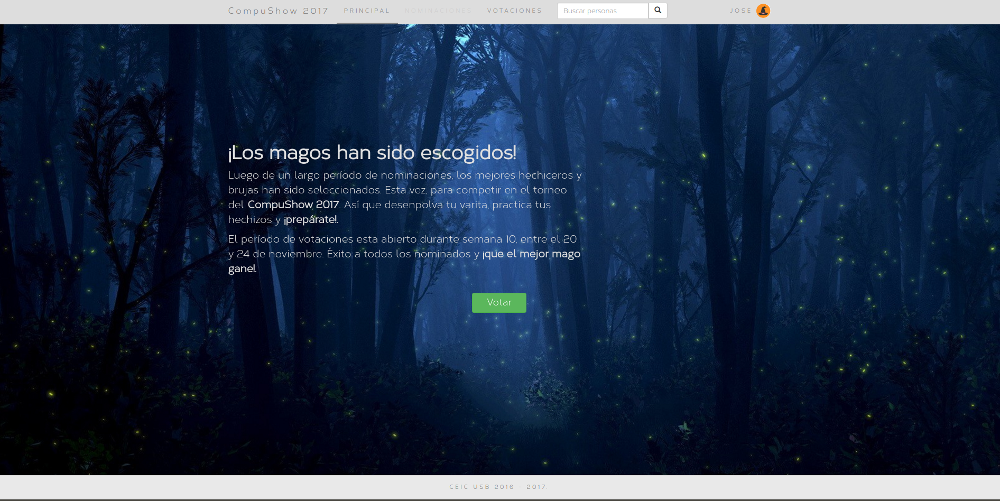
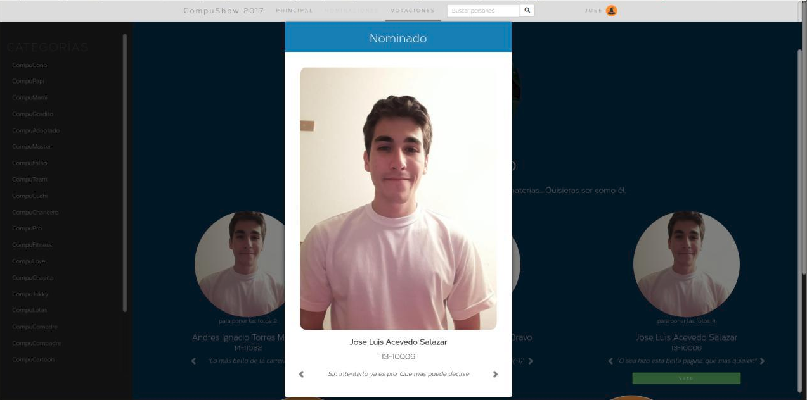

# CompuSoft - The Compushow 2017 Software

## Description
CompuSoft is a web-based appplication to nominate students and vote on the categories of the Compushow 2017 hosted by the Students Center of Computer Science, University Simón Bolívar.

<div align="center">
	
</div>
<div align="center">
	
</div>

## Requirements
```
* Python 3.4.6
* Django 1.10
* PostgreSQL 9.5
* psycopg2
* ldap3
* Pillow
```

## Installation
Run compusoftinstall.sh script and enter 'compusoft' as password when prompted.
```
./compusoftinstall.sh
```

## License
```
Compusoft is distributed under the terms of the GNU General
Public License version 2.
```

## Bug Reports
```
Any kind of bug reports are welcome.
If you find a bug in CompuSoft, please send an email.

                                                 Jose Luis Acevedo
                                     joseluisacevedo1995@gmail.com
                                                 usbceic@gmail.com
```

## Acknowledgements
Special thanks to all who contributed in the project, particularly to CEIC 2016-2017 (usbceic@gmail.com).
